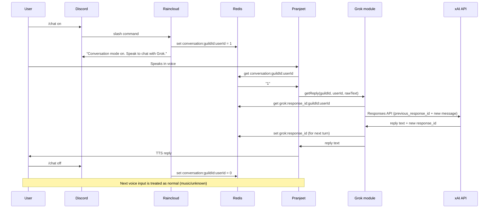

# Add Grok conversation to Pranjeet (with /chat and conversation mode)

## Goal

- User runs `**/chat**` (slash command) to enter **conversation mode**. While in that mode, their voice input is sent to Grok and the reply is spoken via TTS. Music commands are not processed in conversation mode.
- User can run `**/chat**` again (e.g. toggle or subcommand **off**) to leave conversation mode and return to normal voice commands (play, skip, etc.).

## Architecture

## 1. Conversation mode state (Redis)

- **Key**: `conversation:{guildId}:{userId}`
- **Value**: `"1"` = on, `"0"` or missing = off
- **Rationale**: Same Redis as raincloud voice state and pranjeet TTS so both apps see the same state; works with multiple pranjeet instances.

**Raincloud**

- In [apps/raincloud/lib/voiceStateManager.ts](apps/raincloud/lib/voiceStateManager.ts) add:
  - `setConversationMode(guildId: string, userId: string, enabled: boolean): Promise<void>`  
    When `enabled === false`, also delete `grok:response_id:{guildId}:{userId}` so the next `/chat on` starts a fresh thread.
  - `getConversationMode(guildId: string, userId: string): Promise<boolean>`

**Pranjeet**

- Pranjeet must **read** (and for Grok, **write**) Redis in the voice commandHandler. Add a small Redis helper (e.g. `apps/pranjeet/src/conversation-mode.ts` or shared `redis.ts`) using existing `REDIS_URL` / ioredis: `getConversationMode(guildId, userId): Promise<boolean>`. If `REDIS_URL` is unset, treat as false. Same helper or Grok module will read/write `grok:response_id:{guildId}:{userId}` for the stateful API (see below).

## 2. Slash command `/chat` (Raincloud)

- **File**: New [apps/raincloud/commands/voice/chat.js](apps/raincloud/commands/voice/chat.js) (or `utility/chat.js`).
- **Options**: Follow pattern of [voice-control.js](apps/raincloud/commands/voice/voice-control.js): subcommands e.g. **on** | **off** | **toggle** | **status**.
- **Behavior**:
  - Resolve `guildId` and `userId` from `interaction`.
  - Use `getVoiceStateManager()` (same as voice-control) to get the manager that has Redis; add and use `setConversationMode` / `getConversationMode` on it (see above).
  - **on**: set true, reply ephemerally e.g. "Conversation mode on. Your voice will be sent to Grok until you turn it off."
  - **off**: set false, reply "Conversation mode off. Voice commands work as usual."
  - **toggle**: read current, flip, reply with new state.
  - **status**: reply "Conversation mode is on/off."
- Register the command (same way other voice commands are loaded in raincloud).

## 3. Grok module (Pranjeet) — xAI stateful Responses API

- **New file**: e.g. [apps/pranjeet/src/chat/grok.ts](apps/pranjeet/src/chat/grok.ts).
- **Config** in [apps/pranjeet/src/config.ts](apps/pranjeet/src/config.ts): `GROK_API_KEY` (or `XAI_API_KEY`), `GROK_MODEL` (default e.g. `grok-4-1-fast-reasoning`), `GROK_ENABLED`.
- **Conversation state**: Use xAI’s **stateful Responses API** (not Legacy Chat Completions). Store one **response ID** per user per guild in Redis: key `grok:response_id:{guildId}:{userId}`. When the user turns conversation mode **off**, raincloud already deletes this key (see §1); pranjeet only reads/writes it.
- **Behavior** of `getGrokReply(guildId, userId, userMessage): Promise<string>`:
  - **First turn** (no `previous_response_id` in Redis): Call xAI Responses API to create a new response: system message (friendly voice assistant, concise for TTS) + user message. Persist returned `response.id` to Redis; return reply text.
  - **Later turns**: Read `previous_response_id` from Redis. Call Responses API with `previous_response_id` and the new user message only. Save the new `response.id` to Redis; return reply text.
  - Use the endpoint and request shape from [xAI Responses API](https://docs.x.ai/developers/model-capabilities/text/generate-text) (create response, then continue with `previous_response_id`). xAI stores the thread server-side (e.g. 30 days); we only store the latest response ID.
  - On error (e.g. invalid/expired id): log, optionally clear Redis response_id, and return a short fallback string.

## 4. Wire commandHandler to conversation mode + Grok (Pranjeet)

- **File**: [apps/pranjeet/src/index.ts](apps/pranjeet/src/index.ts).
- In the existing `commandHandler`:
  1. **If** conversation mode is **on** for `session.guildId` + `session.userId` (via Redis helper) **and** Grok is enabled and has an API key:
  - Call `getGrokReply(session.guildId, session.userId, command.rawText)`.
  - Return `{ success: true, command, response: grokReply }` (so the manager speaks it via TTS).
  2. **Else**: keep current behavior (music commands → proxy to raincloud; non-music → return `null` so manager uses default “unknown” handling).

Optional: In conversation mode, allow a voice phrase like “exit” or “stop chatting” to clear conversation mode (pranjeet would call Redis to set the key to 0). That requires pranjeet to be able to **write** Redis for this key (same helper, add `setConversationMode`).

## 5. Env and docs

- **Pranjeet**: `GROK_API_KEY`, `GROK_MODEL`, `GROK_ENABLED` (and existing `REDIS_URL` for conversation mode).
- **Raincloud**: No new env; reuses existing Redis used by VoiceStateManager.
- Document in [.env.example](.env.example) or app-level env example.

## 6. Validation

- `yarn validate` passes.
- Manual: run `/chat on`, speak in voice → Grok reply spoken; `/chat off` → next utterance handled as normal (music or “I didn’t understand”).

## Out of scope (for later)

- Text-based chat (e.g. slash command that sends one message to Grok and replies in channel).
- Streaming TTS while Grok streams.
