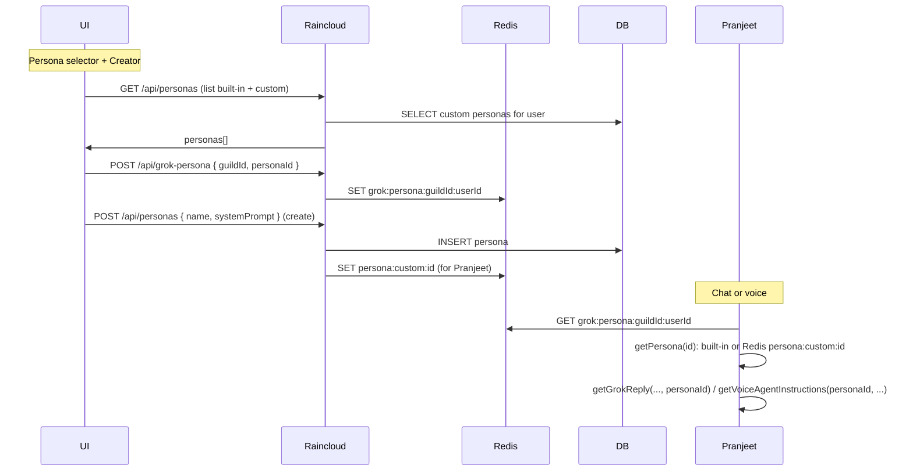

# Selectable personas and persona creator (UI + backend)

## Goals

1. **Selectable personas**: User can choose which persona is used for Grok chat and voice in a given server (per user per guild, like Grok voice).
2. **Persona creator**: User can create custom personas in the UI (name + system prompt); custom personas appear in the selector and can be edited/deleted.

## Current state

- **Personas**: Built-in only in [apps/pranjeet/src/prompts/](apps/pranjeet/src/prompts/) (e.g. `default`). [getSystemPromptForChat](apps/pranjeet/src/prompts/index.ts) and [getVoiceAgentInstructions](apps/pranjeet/src/prompts/index.ts) accept optional `personaId` but nothing passes it yet.
- **Grok voice** (reference): Stored in Redis `grok:voice:${guildId}:${userId}`. Raincloud [VoiceStateManager](apps/raincloud/lib/voiceStateManager.ts) get/set; API GET/POST `/api/grok-voice`; UI dropdown in [AdminTab](ui/src/components/tabs/AdminTab.tsx) under "Grok conversation mode".
- **Chat/voice usage**: [getGrokReply](apps/pranjeet/src/chat/grok.ts) and [createGrokVoiceAgentClient](apps/pranjeet/src/voice-agent/grokVoiceAgent.ts) are called from pranjeet with `guildId`/`userId`; neither reads nor passes `personaId`.

## Architecture overview

- **Current selection**: Redis key `grok:persona:${guildId}:${userId}` stores the chosen `personaId` (string).
- **Built-in personas**: Stay in pranjeet code ([prompts/personas](apps/pranjeet/src/prompts/personas/)); ids e.g. `default`.
- **Custom personas**: Stored in Postgres (raincloud DB) and mirrored to Redis so pranjeet can resolve without DB access. Key `persona:custom:${id}` = JSON `{ id, name, systemPrompt }`.

---

## 1. Backend: storage and API

### 1.1 Redis (current selection + custom payload for Pranjeet)

- **Raincloud** [VoiceStateManager](apps/raincloud/lib/voiceStateManager.ts):
  - `getGrokPersona(guildId, userId): Promise<string | null>`
  - `setGrokPersona(guildId, userId, personaId: string): Promise<void>`
  - Key: `grok:persona:${guildId}:${userId}`; value: persona id (no validation that id exists; invalid id will fall back in pranjeet).
  - Optional: `setCustomPersonaInCache(id, { name, systemPrompt }): Promise<void>` and `getCustomPersonaFromCache(id)` for syncing custom persona payload to Redis (key `persona:custom:${id}`). Used when creating/updating a custom persona so Pranjeet can read it.
- **Pranjeet** [redis.ts](apps/pranjeet/src/redis.ts):
  - `getGrokPersona(guildId, userId): Promise<string | null>` — key `grok:persona:${guildId}:${userId}`.
  - `getCustomPersona(id: string): Promise<{ id: string; name: string; systemPrompt: string } | null>` — read `persona:custom:${id}` (JSON). Used by prompts when resolving persona by id.

### 1.2 Database (custom personas only)

- **Schema** (in [utils/database.ts](utils/database.ts) with other CREATE TABLEs):
  - Table `grok_personas`: `id` (UUID PRIMARY KEY), `user_id` (VARCHAR, who created), `name` (VARCHAR), `system_prompt` (TEXT), `created_at` (TIMESTAMP). Scope: one row per custom persona; `user_id` = Discord user id of creator.
  - No guild scope: custom personas are “my personas” per user; same list everywhere for that user.
- **Raincloud API** ([apps/raincloud/server/routes/api.ts](apps/raincloud/server/routes/api.ts)):
  - **GET /api/personas** (requireAuth): Return list of personas: built-in (from a static list or small module that mirrors pranjeet’s built-in id/name only, no systemPrompt) plus custom from DB for `req.user.id`. Shape e.g. `{ personas: { id, name, isBuiltIn }[] }`. Optional: include `systemPrompt` for custom only so UI can edit.
  - **GET /api/personas/:id** (requireAuth): Return one persona by id. If built-in, return from static list (id, name, systemPrompt from pranjeet or a copy). If custom, load from DB; ensure `user_id === req.user.id`; then return. Used by UI for “edit” and by backend if needed.
  - **POST /api/personas** (requireAuth): Body `{ name, systemPrompt }`. Validate (non-empty name, systemPrompt string, reasonable length limits). Insert into `grok_personas` with new UUID, `user_id = req.user.id`. Write to Redis `persona:custom:${id}` with `{ id, name, systemPrompt }`. Return `{ id, name }`.
  - **PUT /api/personas/:id** (requireAuth): Update custom persona. Load from DB; ensure `user_id === req.user.id`; update name/system_prompt; update Redis cache.
  - **DELETE /api/personas/:id** (requireAuth): Delete custom persona. Ensure ownership; delete from DB; delete Redis key `persona:custom:${id}`.
  - **GET /api/grok-persona/:guildId** (requireAuth, requireGuildMember): Return current user’s selected persona id for that guild. Read from VoiceStateManager `getGrokPersona(guildId, userId)`; return `{ personaId: string | null }`.
  - **POST /api/grok-persona** (requireAuth, requireGuildMember): Body `{ guildId, personaId }`. Set via VoiceStateManager `setGrokPersona(guildId, userId, personaId)`. Allow empty string or null to “clear” back to default (pranjeet will treat missing as default).

Built-in list for API: raincloud can either (a) import from a shared package that re-exports persona ids/names from pranjeet, or (b) keep a small static list in raincloud, e.g. `[{ id: 'default', name: 'Convenience store philosopher', isBuiltIn: true }]`, and not send systemPrompt for built-in (pranjeet has it). Option (b) avoids coupling and is enough for the selector.

### 1.3 Pranjeet: resolve persona and use it

- **Resolve persona by id** ([apps/pranjeet/src/prompts](apps/pranjeet/src/prompts/)):
  - In `getPersona(id)` (or a new internal `getPersonaWithCustom(id)`), first check built-in registry; if not found, call `getCustomPersona(id)` from redis; return type still `Persona | null`. So pranjeet never talks to DB; custom content comes from Redis.
  - Ensure [getSystemPromptForChat](apps/pranjeet/src/prompts/index.ts) and [getVoiceAgentInstructions](apps/pranjeet/src/prompts/index.ts) use this resolver so custom personas work for both chat and voice.
- **Use selected persona in chat and voice**:
  - Where [getGrokReply](apps/pranjeet/src/chat/grok.ts) is called ([index.ts](apps/pranjeet/src/index.ts) commandHandler, [handlers/rpc.ts](apps/pranjeet/src/handlers/rpc.ts) grokChat): before calling, read `personaId = await getGrokPersona(guildId, userId)` (from pranjeet redis). Pass `personaId ?? undefined` into `getGrokReply(..., personaId)`.
  - Where [createGrokVoiceAgentClient](apps/pranjeet/src/voice-agent/grokVoiceAgent.ts) is created: same; read `getGrokPersona(guildId, userId)` and pass personaId into the client. Inside the client, when building session instructions, call `getVoiceAgentInstructions(personaId ?? undefined, tools.length > 0)` instead of `getVoiceAgentInstructions(undefined, ...)`.

So the only new “wire” is: pranjeet reads `grok:persona:${guildId}:${userId}` and passes that id into existing prompt APIs; prompt API resolves id via built-in + Redis custom.

---

## 2. UI: selectable personas and persona creator

### 2.1 Persona selector (same area as Grok voice)

- In [AdminTab](ui/src/components/tabs/AdminTab.tsx), in the “Grok conversation mode (voice)” card (where the Grok voice dropdown is):
  - Add a **Persona** dropdown (or list) above or below the voice dropdown.
  - Data: `GET /api/personas` → list of `{ id, name, isBuiltIn }` (and optionally systemPrompt for custom for edit).
  - Current selection: `GET /api/grok-persona/:guildId` → `personaId`; show it in the selector (default option e.g. “Default (Convenience store philosopher)” when null/empty).
  - On change: `POST /api/grok-persona` with `{ guildId, personaId }`. Optimistic update + invalidate query like the voice dropdown.
  - Only show when `runGuildId` is set (same as voice/conversation mode section).

### 2.2 Persona creator

- **Entry**: Button “Create persona” or “Manage personas” that opens a modal or a dedicated small section.
- **Create flow**: Modal or inline form with:
  - **Name** (required): short label (e.g. “Friendly assistant”).
  - **System prompt** (required): multiline textarea, placeholder with short guidance (e.g. “Instructions for how the AI should behave. Used for both text and voice.”).
  - Submit → `POST /api/personas` with `{ name, systemPrompt }`. On success, add to local list and optionally set as current persona for the selected guild.
- **List**: Show user’s custom personas (from same GET /api/personas). Each row: name, “Edit”, “Delete”. “Use” or “Select” can set it as current for the selected server (POST /api/grok-persona).
- **Edit**: “Edit” opens modal pre-filled with name and systemPrompt (GET /api/personas/:id if needed). Save → PUT /api/personas/:id.
- **Delete**: Confirm then DELETE /api/personas/:id. If deleted persona was selected for current guild, clear selection (POST /api/grok-persona with null/default).

### 2.3 API client (UI)

- In [ui/src/lib/api.ts](ui/src/lib/api.ts) add:
  - `getPersonas()`, `getPersona(id)`, `createPersona({ name, systemPrompt })`, `updatePersona(id, { name, systemPrompt })`, `deletePersona(id)`.
  - `getGrokPersona(guildId)`, `setGrokPersona(guildId, personaId)`.

---

## 3. Implementation order

1. **DB + Redis (raincloud)**
   Add table `grok_personas`. Add VoiceStateManager get/set for grok persona and optional get/set for custom persona cache. Add Redis key for `persona:custom:${id}` when creating/updating custom persona.
2. **Pranjeet Redis + prompts**
   Add `getGrokPersona`, `getCustomPersona` in pranjeet redis. In prompts, resolve persona by id (built-in then Redis). Wire `getGrokPersona` into `getGrokReply` and `createGrokVoiceAgentClient` and pass `personaId` into prompt APIs.
3. **Raincloud API**
   Implement GET/POST grok-persona, GET (list) / GET by id / POST / PUT / DELETE personas. For list, combine built-in (static) + DB custom for current user. On create/update custom, write Redis cache.
4. **UI**
   Add persona selector to AdminTab (Grok section). Add persona creator (create/edit/delete) and wire to new API. Use same “Run commands” server for grok-persona as for voice.

---

## 4. Edge cases and notes

- **Invalid or deleted persona**: If selected personaId is missing (e.g. custom deleted elsewhere), pranjeet’s getPersona returns null and existing fallback (default prompt) is used. UI can show “Default” when personaId is null or when GET /api/personas/:id 404s for current selection.
- **Length limits**: Enforce max length for name (e.g. 100) and system_prompt (e.g. 20_000) in API to avoid abuse.
- **Built-in list in raincloud**: Keep a minimal list of built-in ids and names for the dropdown; do not duplicate full systemPrompt in raincloud. Pranjeet remains source of truth for built-in content.
- **Permissions**: Only the user who created a custom persona can edit/delete it. Listing only returns that user’s custom personas plus built-in.

---

## 5. File checklist (summary)

| Layer     | File(s)                                                                                      | Changes                                                                |
| --------- | -------------------------------------------------------------------------------------------- | ---------------------------------------------------------------------- |
| DB        | [utils/database.ts](utils/database.ts)                                                       | CREATE TABLE grok_personas                                             |
| Raincloud | [lib/voiceStateManager.ts](apps/raincloud/lib/voiceStateManager.ts)                          | getGrokPersona, setGrokPersona; optional custom cache helpers          |
| Raincloud | [server/routes/api.ts](apps/raincloud/server/routes/api.ts)                                  | GET/POST grok-persona; GET/POST/GET:id/PUT/DELETE personas             |
| Pranjeet  | [redis.ts](apps/pranjeet/src/redis.ts)                                                       | getGrokPersona, getCustomPersona                                       |
| Pranjeet  | [prompts/index.ts](apps/pranjeet/src/prompts/index.ts) (or personas resolver)                | Resolve persona: built-in then Redis custom                            |
| Pranjeet  | [chat/grok.ts](apps/pranjeet/src/chat/grok.ts)                                               | Already has personaId param                                            |
| Pranjeet  | [index.ts](apps/pranjeet/src/index.ts), [handlers/rpc.ts](apps/pranjeet/src/handlers/rpc.ts) | Read getGrokPersona; pass personaId to getGrokReply                    |
| Pranjeet  | [voice-agent/grokVoiceAgent.ts](apps/pranjeet/src/voice-agent/grokVoiceAgent.ts)             | Accept personaId (e.g. from closure); use in getVoiceAgentInstructions |
| UI        | [lib/api.ts](ui/src/lib/api.ts)                                                              | Personas and grok-persona API methods                                  |
| UI        | [components/tabs/AdminTab.tsx](ui/src/components/tabs/AdminTab.tsx)                          | Persona dropdown, create/edit/delete personas section or modal         |

This plan keeps built-in personas in pranjeet, custom personas in DB + Redis cache, and uses the same per-user-per-guild selection pattern as Grok voice for a consistent and maintainable implementation.
